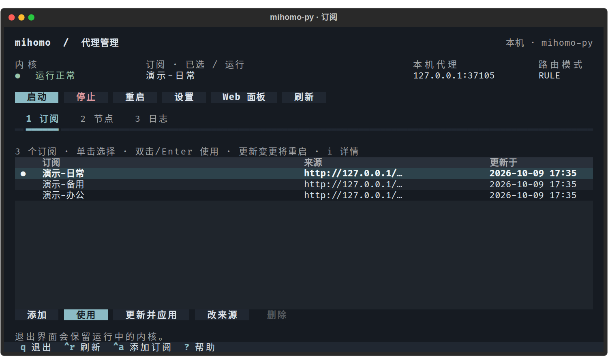
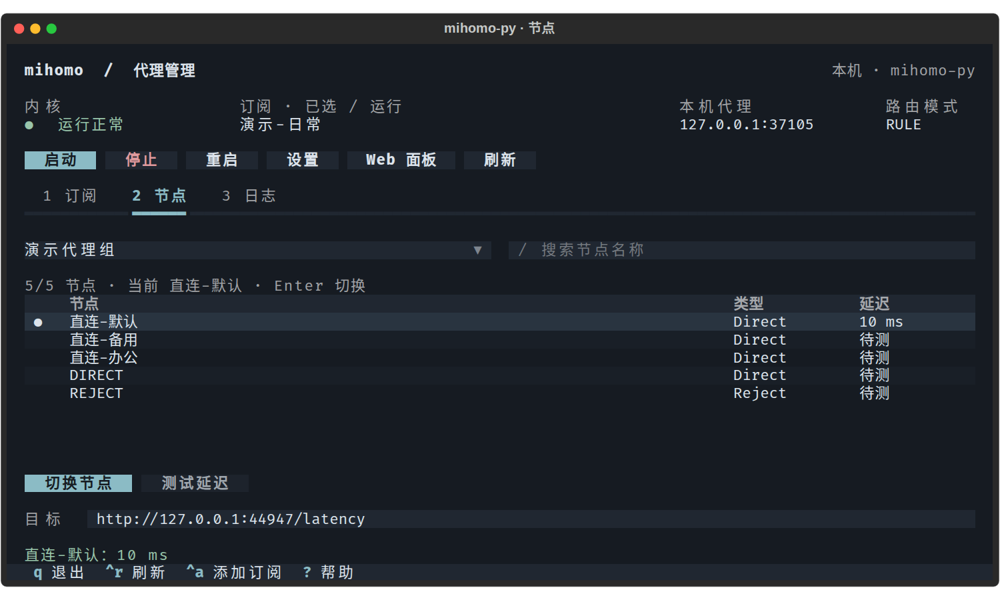
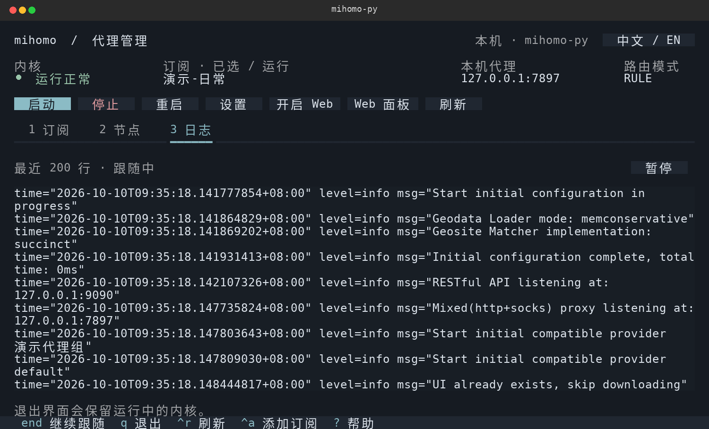
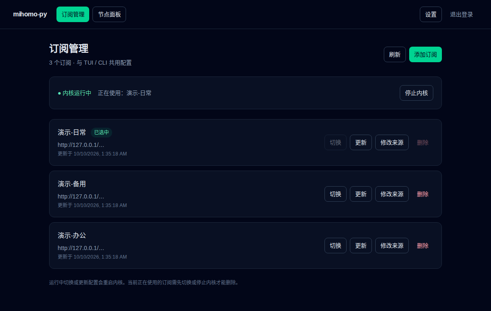

<div align="center">

# mihomo-py

**服务器代理，一屏掌控。**

订阅、节点、日志，都在终端里。SSH 连上就能用。

[](https://pypi.org/project/mihomo-py/)
[](https://pypi.org/project/mihomo-py/)


[English](README.md) · [简体中文](README.zh-CN.md)

</div>



面向 Linux 服务器的 [mihomo](https://github.com/MetaCubeX/mihomo) 客户端。添加订阅、启动内核，用鼠标或键盘管理代理。**内核和默认 GEO 数据库随包附带**，无需单独下载。

## 安装，打开，开始用

```bash
python -m pip install mihomo-py
mihomo-py
```

需要 **Python 3.11+**、支持 pidfd 的 **Linux 5.3+** 内核，支持 **x86_64 / aarch64**、系统 Python 和 Conda。建议终端至少 **80 × 24**；TUI 首次按系统语言选择中文或英文。

1. 点击 **添加**，或按 `Ctrl+A`，填写名称和订阅 URL / 本地 YAML 路径。
2. 选中订阅，按 `Enter` 使用。
3. 点击 **启动**，HTTP/SOCKS 代理默认位于 `127.0.0.1:7897`。

订阅须为完整的 Clash/mihomo YAML 配置；不支持 Base64 节点列表或单节点链接。

## 找节点，切换，测速



按 `2` 打开节点页，选择代理组，按 `/` 搜索。手动组中按 `Enter` **立即切换节点**，点击 **测试延迟** 测试单个节点。重启内核后，节点选择仍会保留。

## 看日志，不丢阅读位置



按 `3` 查看日志，向上滚动暂停跟随，按 `End` 回到最新内容。按 `q` 退出界面，**后台内核继续运行**。

`1 / 2 / 3` 切页 · `i` 查看详情 · `?` 查看快捷键。[完整 TUI 指南 →](docs/tui.md)

## 想用浏览器？也可以



执行 `python -m pip install 'mihomo-py[web]'`，进入 TUI 后点击 **开启 Web**；服务会在后台持续运行，点击 **Web 面板** 获取地址和登录密钥。独立 Web 入口可管理订阅。[配置方法 →](docs/subscriptions-web.md)

## 更多用法

[命令行与脚本](docs/cli.md) · [TUI 指南](docs/tui.md) · [文档导航](docs/README.md) · [离线安装](docs/packaging.md)

代理默认监听 `127.0.0.1`；带密钥验证的管理 API 默认监听 `0.0.0.0:9090`，请在可信网络使用，或在 **设置** 中修改监听地址。当前不提供 TUN 和系统代理自动配置。

*截图使用隔离的本地演示配置：直连节点、本地测速目标，不含真实订阅凭证。内置资源保留各自的[上游许可与归属说明](src/mihomo_py/_vendor/NOTICE.txt)。*
